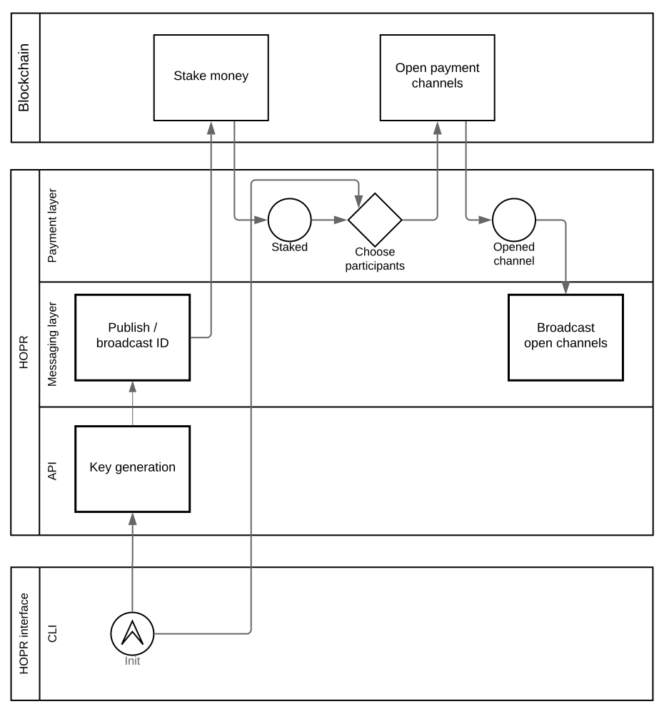
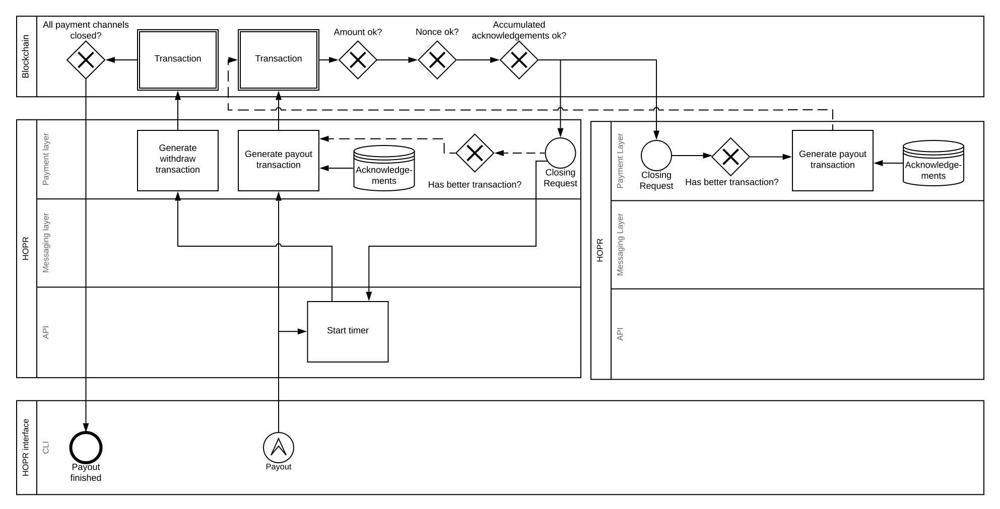

# HOPR-PL-Substrate

This document details a [HOPR](https://github.com/validitylabs/hopr) payment layer implementation in Substrate.

# Context

Web3 is a stack of technologies that enable truly decentralized applications (dApps) featuring increased privacy and resilience for the next wave of web applications. Early examples working towards dApps are decentralized organizations (DAOs, e.g. by [Aragon](https://aragon.org/)), media platforms such as [Joystream](https://www.joystream.org/) or global pension infrastructure like [Akropolis](https://akropolis.io). Currently we see technological pillars emerging for building true dApps that do not rely on central infrastructure anymore:

1. Asset transfer systems like those enabled by blockchains
2. Data storage solutions like [Filecoin](https://filecoin.io/) or [NuCypher](https://www.nucypher.com)
3. Computation providers like [Golem](https://golem.network/) or [Enigma](https://enigma.co/)

In this new ecosystem, multiple decentralised applications (dApps) interact with one another as well as with these core technologies. All pillars feature projects that focus on privacy within that domain. For example, we see on-chain privacy solutions such as [ZCash](https://z.cash/), [AZTEC](https://www.aztecprotocol.com/) on Ethereum or [SubstraTee](https://github.com/scs/substraTEE) for Substrate, privat data storage by re-encryption in NuCypher and privacy-preserving computation in Enigma. At the same time, the ecosystem is lacking a go-to solution for network-level privacy enabling communication between separate networks, applications and users. Some dApps make use of Whisper which is developed by the Ethereum community but which - similar to other broadcast schemes - suffers from scalability restrictions when used for point-to-point communication and unclear delivery behavior. We build HOPR as a metadata-privat communication foundation of the Web3.

<table>
    <tbody>
        <tr>
            <td colspan=3 align="middle"><b>dApps</b></td>
        </tr>
        <tr>
            <td align="middle" width=33%><b>Assets</b>
             Bitcoin, ZCash, tokens</td>
            <td align="middle" width=33%><b>Storage</b>
             Filecoin / IPFS, NuCypher</td>
            <td align="middle" width=33%><b>Computation</b>
             Golem, Nucypher</td>
        </tr>
        <tr>
            <td colspan=3 align="middle"><b>Messaging</b> HOPR</td>
        </tr>
    </tbody>
</table>

HOPR fills the gap between p2p networks and dApps that exchange sensitive information. HOPR adds metadata privacy on top of an existing P2P layer that is used in form of [libp2p](https://libp2p.io) or [WebRTC](https://en.wikipedia.org/wiki/WebRTC) in decentralized architectures today. It is compatible with underlying network protocols such as [TCP/IP](https://en.wikipedia.org/wiki/Internet_protocol_suite) or [QUIC](https://webrtc.org). Depending on the application, one layer above HOPR could be an optional storage / sync lauer which then enables e.g. chat application with longer-term message caching.

Data packages produced by dApps may not just contain valuable data but may also reveal metadata that can be linked to real-world identities. On-chain privacy, for example, is of limited impact if a network observer can link metadata to a social media account in order to attack the person because of the fact *that* they used privacy-preserving financial networks - without knowing *what* exactly they used them for.

<table>
    <thead>
        <tr>
            <td width=20%><b>Layer</b></td> 
            <td width=60%><b>Purpose</b></td>
            <td width=20%><b>Examples</b></td>
        </tr>
    <tbody>
        <tr>
            <td>Application</td>
            <td>Application logic</td>
            <td>Chat app</td>
        </tr>
        <tr>
            <td>Storage / Sync</td>
            <td>Synchronisation of data, version management, medium-term message caching</td>
            <td><a href="https://matrix.org">Matrix</a></td>
        </tr>
        <tr>
            <td><b>Privacy</b></td>
            <td>Scalable, decentralised metadata protection. Incentivisations for packet relayers and short-term packet caching</td>
            <td><b>HOPR</b></td>
        </tr>
        <tr>
            <td>P2P</td>
            <td>Overlay routing, NAT traversal</td>
            <td>libp2p, WebRTC</td>
        </td>
        <tr>
            <td>Network</td>
            <td>Underlay routing, congestion control</td>
            <td>TCP / IP, QUIC</td>
        </tr>
    </tbody>
</table>

# Architecture overview

HOPR comprises multiple layers: an API faces applications built with HOPR, a message layer performs the cryptographic operations that ensure privacy of the network participants, as well as a payment layer that provides incentive for relay node operators by interfacing a distributed ledger system. It uses an internal API connecting HOPR nodes to distributed ledgers like Polkadot / Substrate or Ethereum.

On the network layer, HOPR achieves metadata privacy by implementing a Chaumian [mixnet](https://en.wikipedia.org/wiki/Mix_network). For details concerning the messaging layer and especially the packet format, we refer to the [HOPR repository](https://github.com/validitylabs/hopr).

<table>
    <tbody>
        <tr>
            <td>Application(s)</td>
            <td>CLI/UI</td>
        </tr>
        <tr>
            <td rowspan=3><b>HOPR</b></td>
            <td><b>API</b></td>
        </tr>
        <tr>
            <td><b>Message layer</b></td>
        </tr>
        <tr>
            <td><b>Payment layer</b></td>
        </tr>
        <tr>
            <td>Polkadot</td>
            <td>Distributed ledger</td>
        </tr>
    </tbody>
</table>

# Payment layer

Metadata private data exchange requires the help of third parties participating in the mixnet. In order to provide a mixnet that can operate at global scale we introduce payments for relay node operators without undermining the privacy of the network. Such an incentive should provide a significant business model for node operators to fulfill traffic demand for metadata-private communication at large scale.

The main architectural objectives of HOPR are:
- **simplicity**: The interactions with the blockchain should be as simple as possible to prevent mistakes in applications and to decrease the effort that is necessary to formally proof security properties of the system.
- **efficiency**: As on-chain computation is costly, we prevent expensive operations like NIZK proof verification whereever we can and make use of second layer scalability solutions such as payment channels.

The core design choices of HOPR are:
- **happy path optimization**: In order to reduce overhead in the more common happy path of successful package delivery, we accept some efficiency reductions in the unhappy path.
- **near-real-time** communication: In order to provide acceptable privacy, message delivery in the HOPR network has higher latency than direct communication. While latency is configurable from the application layer it should be possible to achieve latencies of *under 1 second*.

## Role of the blockchain resp. Polkadot for HOPR

Each node in the network is able to alter its local state independently. It can then convince other nodes of the validity of the state change. Other nodes may then use the advertised state change as well as the global state upon which a consensus has been reached to check the plausibility. If a node found a state change appropriate, it most likely performs the requested actions.

More precisely, in order to initiate and become part of the network, a HOPR node locks some funds in a HOPR payment channel and publishes that state change to the network. In order to send a data package through HOPR, the node creates a local state change that moves a small amount of funds from its own account to the account of the first relay node that relays the message via further relay nodes to the recipient. The relay node checks whether the sender has indeed locked enough funds in the channel for that value transfer. Furthermore, the relaying node checks whether the state change is currently the most recent state that follows the previously known state. As HOPR nodes increment counters on every change, the first relayer accepts, when coming from state *n*, only a state change to state *n+1*. In particular, it rejects a second state change attempt to state *n+1* (double spend).

Once in a while, nodes merge their local state with the global state. Therefore, they publish their accumulated state changes and ask the blockchain network to verify that state change closing or withdrawing from the payment channel. The verifiers in the network learn whether the local state changes of that particular node have led to valid state.

HOPR makes use of special behavior of programmable distributed ledger systems that can force senders of transactions to reveal pre-images of one-way functions like hash functions or elliptic curve operations into a transaction even if only the result of the respective one-way function is necessary to verify the embedded signature.

In order to keep the on-chain transaction costs for opening and closing payment channels low, HOPR relies on a Substrate-based chain that is highly optimized to the specific purpose as opposed to general-purpose and more expensive smart contract platforms like Ethereum. In addition, upon launch of Polkadot, HOPR benefits from interoperability gains with other applications and infrastructure in the ecosystem.

## What HOPR incentivizes

The goal of the payment layer is to incentivise operations on the message layer. In order to do that, we specify those actions we want to pay nodes for:
- **correct transformation** of packets such that the next downstream nodes is able to perform their transformations on the received packets
- **delivery of the packet** to the next node and caching the packet for a short timespan, e. g. 2 hours, until the next downstream node is able to receive the packet

The only party who can prove this is the next downstream node by acknowledging the reception and the validity of the packet. For that reason, the sender prepares several secrets that are derivable by the nodes along the path while creating the whole packet. These secrets are then used to create a two-out-of-two secret sharing between every two adjacent nodes along the path. The sender then applies a one-way function on the second key share and embeds that value in the part of the packet that is visible to the first node. This allows the first node to check whether the derived value and the value which it is going to receive from the next downstream node are sufficient to reconstruct the secret that is embedded in the secret sharing. It also allows the first node to challenge the second node for sending back the desired secret share. In case the second node answers with an invalid acknowledgement, it gives the first node an evidence to prove towards the distributed ledger that the acknowledgement was invalid.

## Techniques

Each hop possesses a key pair which is also used as an address of that node. Once a hop receives a packet, it multiplies the embedded curve point with its own private key and derives the Intermediate Keying Material (IKM). The nodes use that keying material to derive multiple keys that are necessary to process the packet.

## Elliptic-curve cryptography

HOPR makes use of elliptic-curve cryptography whenever asymmetric key operations are necessary. Elliptic-curve cryptography (ECC) comes with the advantage of very short public keys in comparison to previously used asymmetric cryptography over natural numbers. ECC also comes with the counterintuitive property that addition and multiplication are easy to compute whilst when given the points `P, G` finding a cofactor `a` such that `a * G = P` is most likely infeasible with current computers. The "division" problem therefore translates into the *discrete logarithm problem* on natural numbers.

### Secret-sharing

The sender of the packet uses the public keys to derive a secret sharing between every two adjacent nodes on the selected path. For simplicity, assume for the moment that there are only three nodes involved: one sender, one relayer and one receiver.

As the sender knows the whole path, they know the IKMs of the relayer and the receiver. Each node is able to derive two different keys, *s_a* and *s_b*, for the secret sharing: *s_a* is derived when relaying a packet, *s_b* is used when generating an acknowledgement.

Once the sender receives the packet, they compute the secret *s* as `s_a + s_b = s` where `+` denotes addition over a finite field of the elliptic curve. When acting as a relayer, they receive *S* as well as *S_b = s_b \* G* from the sender and check that

`s_a * G + S_b = s_a * G + s_b * G = (s_a + s_b) * G = S`

The multiplication with the base point `G` of the curve is hereby used as a one-way function. When closing a payment channel, the on-chain application logic requires from the transaction sender to present `s = s_a + s_b` instead of *S*. 

### Payment channels

HOPR uses payment channels between adjacent nodes in the network and routes payments along these edges. 

During the initialisation phase, each node crawls the network in order to find others who are also willing to speak the HOPR protocol. They then select from the set of received nodes a subset of nodes with whom they intend to establish a payment channel.

Initialising a payment channel means that two participants agree on a certain amount of assets from each of them and lock these assets until both of them agree on how to distribute them. In case they do not find a consensus, they always have the chance to restore the original or latest stored status that is signed off from both sides. Once they agree on a new distribution, they both sign a message that encodes the new state and store this transaction until either one of them initiates a payout or they agree on another distribution.

State changes are incrementally numbered such that an honest node is able to convince the distributed ledger of the rightful most recent state of the payment channel. In order to give nodes that opportunity, each node listens to the payment channel closing event and is allowed to present a more recent transaction within a defined amount of time.

### Updating the balance in a payment channel

Every time a node considers an incoming packet valid, they peal off one layer of encryption and locally update the distribution of the funds in the payment channel with the next downstream node.

Therefore, they extract the secret *S^(n + 1, n + 2)* which denotes the shared secret between the next and the next but one node from the path. Note that it is the responsibility of the sender of the packet to include that secret in the packet header and that an invalid *S^(n + 1, n + 2)* causes a packet loss since the next downstream node drops the packet. The node then subtracts the relay fee from the received funds and updates the local state of the payment channel with the next downstream node.

More precisely, they increment the current index of the payment channel to *index + 1*. They further subtract the relay fee from the received transaction and add the remainder to the balance of the next downstream. Note that this requires an honest behavior of that node. See section [Fairness mechanisms](#fairness-mechanisms) how they are incentivised to behave like that. They also extract *S^(n + 1, n + 2)_i* from the packet and add it to the sum *~S* of the previous secrets *S^(n + 1, n + 2)_i*. The signature is then computed as

`Sig = Sign_A(nonce, index + 1, balance_A - remainder, balance_B, ~S + S^(n + 1, n + 2))`

where *Sign_A* denotes the algorithm that creates a signature with the private key of party A, *nonce* is chosen uniformly at random and only used once, *balance_A* is the current balance of party A and *balance_B* is the current balance of party B.

### Verification of the update transaction

Once a node receives a transaction, they can, as none of the embedded values is blinded, verify whether the signature fits to the expected public key. However, the on-chain application logic accepts that update transaction only if that party is able to present either the cofactor that is required to derive the curve point from base point of that used curve or renounce a fraction of the received funds. The discrete logarithm assumption guarantees that the probability for the sender to derive that cofactor from curve point is negligible.

The motivation for this mechanism is that the payment channel between a node and the next downstream node relies on the acknowledgments that this node receives from the downstream node to which it forwards the messages. More precisely, the settlement and therefore the payout depends on the behavior of third parties. As this contradicts the principle of a payment channel between exactly two parties, both nodes need to be able to settle their payment channel even when others do not acknowledge the reception of packet in time.

Assume now that there is a set *J* that contains the indices of all packet that have not been acknowledged and the relayer only knows the corresponding values *S_i*. Let furter *I* be the set of all packets that have been acknowledged and the relayer knows the corresponding values *s_i*. Note that

`sum(...s_i) * G + product(...S_j) = sum(...s_i) * G + sum(...s_j) * G = (sum(...s_i) + sum(...s_j)) * G = S`

In order to close a payment channel without having all acknowledgements, they pass `sum(...s_i)` and `product(...S_j)` as well as the most recent signed state change of the payment channel to the on-chain application logic which then checks if `sum(...s_i) * G + product(...S_j) = S`. This is possible because all signed state changes are computed over the most recent sum *S* and *S* is therefore known to the smart contract.

### Fairness mechanisms

As described in section [Updating the balance in a payment channel](#updating-the-balance-in-a-payment-channel), HOPR disincentivises nodes to decrease the forwarded relay fees. Note that they might increase the forwarded funds but as nodes in the HOPR network are assumed to behave rationally it is very unlikely that they do that.

Assume now that a relayer decreases the forwarded funds to the next node. More precisely, the reward of the relayer is now higher than intended whilst the reward of next downstream nodes is lower than expected. The reason why the attack of the relayer is not going to be succesful is that they need the acknowledgement of the next downstream node to redeem the funds - which would not send the required acknowledgement unless they receive the expected amount of funds.

In order to determine how many funds are destined to be paid to that node, they need to be able to find out at which position of the path they are. It is therefore the responsibility of the sender of the packet to specify how much money they intend to spend for each hop and embed this information in the part of the packet that is visible to the respective node. More precisely, the sender specifies how many funds in total each node receives from the previous node. As the nodes along the path drop the package once they consider the relay fees too low, the sender is incentivised to embed sufficient funds in the packet to make sure that the packet receives its desired destination.

# Details of the Polkadot integration
HOPR uses Substrate to implement the Polkadot integration. The application logic is similar to the one that [we have built for the Ethereum Virtual Machine (EVM)](https://github.com/validitylabs/hopr).

## General architecture
The Substrate-based HOPR chain uses a custom application logic implemented in Rust as an SRML module compiled either to binary code or to WebAssembly. Normal nodes run native Rust code whilst outdated / not updated nodes obtain the WebAssembly code from the blockchain and run that code. The accounting scheme consist of only one application logic that is currently valid. Therefore, the HOPR chain does not need the *contract* module. Additionally, a native module is significantly more efficient than a WebAssembly smart contract.

## Roadmap:
- **Small dummy testnet:**
   Set up a small chain network with >1 participants and some dummy functionality. There is a very basic Javascript API to trigger dummy functionality and trigger or observe actions.

- **Application logic deployment:**
   The dummy application logic can be compiled to Rust binary code and WebAssembly. It is possible to store the compiled application logic in a block and outdated clients can execute that functionality by using the WASM interpreter `wasmi`. Once they are updated, native Rust code is used. An API call allows the message layer to check if a node is running the latest application code or not.

- **Fungible token:**
   HOPR leverages its custom fungible token. Users can transfer that HOPR token to other users or stake the token for sending or relaying messages with HOPR.

- **Basic payment channels:**
   Users can open and close basic payment channels. There are events showing state changes of payment channels. The message layer can listen to these events.

- **Additively homomorphic payment channels:**
   The application logic can verify the elliptic curve operations. It accepts redacted payment channel settlement requests and is able to check the validity of them. The message layer can publish state changes and listens to events.

- **Coordinated payout scheme:**
   Parties cannot payout more tokens than intended from a payment channel. More precisely, debts due to overpayment to colluding nodes do not result in financial benefit. The message emit warnings when trying to perform inappropriate actions.

- **Slashing for invalid/outdated acknowledgements:**
   Nodes can determine the validity of acknowledgements. They can further create a transaction that proves invalidity to the on-chain application logic. The on-chain logic is able check the validity of that claim and it is able to slash the corresponding node.

- **Payment channel routing:**
   Nodes can use the global state to sample a route of connected nodes through the HOPR network.

- **Polkadot slot leasing:**
   There is a proper way to collect Dots, i. e. by swapping HOPR tokens into Dots in order to lease a slot in Polkadot and get Polkadot's "pooled security".

- **Modularisation:**
   HOPR is modularised in a common message layer and multiple payment layer modules - for now Polkadot and Ethereum. The implementations live in seperate repositories.

# Process details

## Initialisation
Once a party decides to be part of the HOPR network, they create or recover an identity from a private key. It then publishes that identity and the corresponding key to the network such that other participants are able to find them. The node then crawls the network. That crawling process serves two purposes: First, it helps the new node to discover other nodes in the network.
The second argument comes from the fact that a global passive adversary might be able to observe which nodes are asked for other nodes and might be therefore able to determine which nodes might be known and which are unknown.

The crawling is done iteratively by first asking the bootstrap nodes for additional nodes in the network. Then each node selects randomly a subset of the received nodes and asks them for other nodes. It repeats the process a few times such that the number of known nodes is high enough to keep the uncertainty of the potential global adversary at a sufficiently high level.

By doing this, the nodes receive a partial view of the network that is then used to pick a path through the network. Note that the nodes do not get a full overview of the network.

## Message relaying
In order to send a message through the HOPR network, the node crawl the network to look for additional nodes. Afterwards, they establish a route through the HOPR network and derive the cryptographic material to build up the packet by using the keys of the intermediate nodes as well the key of the final receiver. The sender then instructs the payment module to create an update transaction for the payment channel between itself and the first hop on the path.

That hop receives the packet and checks whether it is the designated recipient of that packet. If that is the case, makes the package available to the API, otherwise it checks whether the cryptographic packet format is correct and whether the embedded is valid and whether there is a record in the blockchain of that particular payment channel. In case everything is alright, it transforms the packet such that the next downstream node is able to process it correctly.

The node also sends an acknowledgement back to the previous node which allows that node to compute the keys that are necessary to initate a payout of the corresponding payment channel.

## Payment channels
Each node need to keep track of its open payment channels to other nodes. Note that the assets are bound to the signatures of both participants once the payment channel has been opened. This means that in case one of the participants refuses any communication with the counterparty, the assets might get locked forever. Both of them therefore agree on a closing transaction that restores the previous asset distribution. That transaction has index *0* such that it can be published to the network in case something goes wrong. It loses its validity once both of them agree upon a subsequent transaction which has a higher index, e. g. *1* and one of them publishes the more recent transaction to the network.

For that reason, it is the responsability of the nodes, to store the most recent update transaction as well as the restore transaction as long as the payment channel remains open. Agressive nodes might also store the most profitable transaction and try to publish that transaction instead of the most recent transaction. Both of them publish in a ping-pong manner more recent transactions until they reach either the most recent transaction or a transaction with which both of them want to live.

## Payout
Once a node wants to settle all payment channels in order payout all funds that are in the HOPR network, it creates a payout transaction for each of their open payment channels using the payment module. The payment module consumes the received acknowledgements to compute the desired pre-image. Afterwards, the payment module forwards the transaction to the blockchain which checks via on-chain application logic if the transmitted transaction is valid.

In case everything is fine, the application logic emits an event that is observed by the participants of the payment channel. Each participant then checks whether it possesses a more recent transaction that is more profitable for them. If that is the case, it uses the received acknowledgements and creates its own payout transaction and publishes that transaction to the network.

The on-chain application gives the participants some timeframe during which they can publish a later transaction that is more profitable for them. Once that time interval is due, the initiator of the payout creates a transaction that transfers the assets back to both parties.

To prevent collusion attacks, the nodes need to close all payment channel before they are able to get their assets out of HOPR.

# API
**Disclaimer: the API might change over time. Be aware of breaking changes!**

The purpose of the payment channel module is to interact with the on-chain application logic and keep track of its state. It MUST keep track of the currently open payment channels and it MUST store the data that is necessary to close a payment channel persistently. It MUST also implement an identification scheme that gives each payment channel a unique identifier. This can be done by considering the addresses of both participants as integers and concatenating the lower address to the higher address. The identifier might be the hash of the concatenated addresses.

## create(id: string, signingProvider: SigningProvider): Promise\<PaymentModule\>
Initiates the payment layer module and restores the information of the payment channels that are open at the moment.
- `id` the HOPR id of the node. The information is used to derive the `channelId`
- `signingProvider.sign(msg: string)` 

## send(to: Address, payload: Buffer | string, strategyProvider?: StrategyProvider): Promise
Takes the address of the receiver and the desired payload and encodes that information in a proper HOPR packet. It automatically picks a route through the HOPR network and send the packet to the first hop. It also alters the payment channel to the first hop and transfer the relay fees to the hops on the route. It MUST return a promise that resolves once the first relay in the route acknowledges the forwarding of the packet.
- `to` the HOPR address of the receiver
- `msg` the payload
- `strategyProvider.getRoute(from: Address, to: Address): Address[]` optional. Use a customised route-picking strategy. 

## receive((payload: Buffer | string) => _)
Propagates the reception of a packet to the application layer.
- `(payload: Buffer | string) => _`  called with the payload that was extracted from the received packet. HOPR ignores the output of that function for the moment, in case there is any.

## getChannelId(from?: Address, to: Address): string
Computes the identifier for the channel between `from` and `to`. The identifier SHOULD be chosen in a way such that `to` and `from` commute. If no `from` is given, it MUST take the own address.
- `from` a HOPR address 
- `to` another HOPR address

## openChannel(counterparty: Address): Promise\<Receipt\>
Manually opens a payment channel with `counterparty`. It SHOULD resolve after the corresponding state change has been published to the network and after that state change has been confirmed. It MUST return a receipt for the state change.
- `counterparty` address of the other party that participates in that channel

## closeChannel(counterparty: Address): Promise\<Receipt\>
Manually closes a payment channel with `counterparty`. It SHOULD resolve after the corresponding state change has been published to the network and after that state change has been confirmed. It MUST return a receipt for the state change.
- `counterparty` address of the other party that is part of that channel

## createTransaction(to: Address, amount: BigInt | string): Promise\<Transaction\>
Creates a transaction of `amount` assets to the account of `to`. The signature of that transaction SHOULD be computed over the result of a one-way function such that the on-chain application logic can force the sender to reveal the pre-image of that value.
- `to` the HOPR address of the counterparty
- `amount` amount of assets that are transferred to `to`. The value MUST NOT be given as a Number due to the precision limitations of programming languages.

## checkTransaction(tx: Transaction, P: CurvePoint): Promise\<boolean\>
Check whether a given transaction is valid. It MUST check the signature and it MUST check whether the amount is satisfactory and that there is an open payment channel. Remark: this method only checks the blockchain-related properties, everything else, like the secret sharing, is checked by the message layer.
- `tx` the transaction to check

## storeTransaction(tx: Transaction): Promise
The method is called by the message layer after the message layer has considered the embedded secret sharing valid and `checkTransaction()` returned `true`. The method SHOULD store the transaction persistently.
- `tx` the transaction to store

## getEmbeddedFunds(tx: Transaction): BigInt
Returns the amount of assets that are embedded in the given transaction.
- `tx` the transaction to extract the transferred amount from

## initiatePayout(): Promise\<BigInt\>
Initiates a payout of all payment channels. It MUST close all payment channels and resolve just when all payment channels are either closed or considered abandonned. It SHOULD return the amount of assets that has been received by the HOPR node.

## stakeFunds(amount: BigInt): Promise\<Receipt\>
Locks funds in the application logic such that it is later available to open payment channels.
- `amount` the amount of assets to deposit in the on-chain application logic.