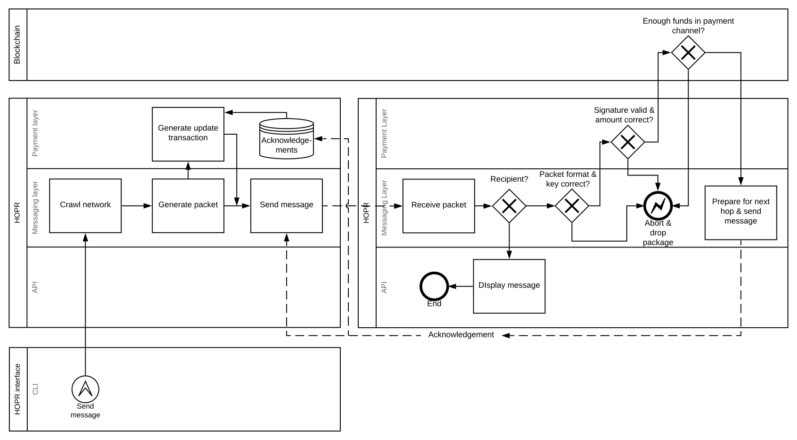

# HOPR-PL-Substrate

This document details a [HOPR](https://github.com/validitylabs/hopr) payment layer implementation in Substrate.

# Context

Web3 is a stack of technologies that enable truly decentralized applications (dApps) featuring increased privacy and resilience for the next wave of web applications. Early examples working towards dApps are decentralized organizations (DAOs, e.g. by [Aragon](https://aragon.org/)), media platforms such as [Joystream](https://www.joystream.org/) or global pension infrastructure like [Akropolis](https://akropolis.io). Currently we see technological pillars emerging for building true dApps that do not rely on central infrastructure anymore:

1. Asset transfer systems like those enabled by blockchains
2. Storage solutions like [Filecoin](https://filecoin.io/) or [NuCypher](https://www.nucypher.com)
3. Computation providers like [Golem](https://golem.network/) or [Enigma](https://enigma.co/)

In this new ecosystem, multiple decentralised applications (dApps) interact with one another as well as with these core technologies. All pillars feature projects that focus on privacy within that domain. For example, we see on-chain privacy solutions such as [ZCash](https://z.cash/) or [AZTEC](https://www.aztecprotocol.com/) on Ethereum, privat data storage by re-encryption in NuCypher and privacy-preserving computation in Enigma. At the same time, the ecosystem is lacking a go-to solution for network-level privacy enabling communication between separate networks, applications and users. Some dApps make use of Whisper which is developed by the Ethereum community but which - similar to other broadcast schemes - suffers from scalability restrictions when used for point-to-point communication and unclear delivery behavior. We build HOPR as a metadata-privat communication foundation of the Web3.

<table>
    <tbody>
        <tr>
            <td colspan=3 align="middle"><b>dApps</b></td>
        </tr>
        <tr>
            <td align="middle" width=33%><b>Assets</b>
             Bitcoin, ZCash, tokens</td>
            <td align="middle" width=33%><b>Storage</b>
             Filecoin / IPFS, NuCypher</td>
            <td align="middle" width=33%><b>Computation</b>
             Golem, Nucypher</td>
        </tr>
        <tr>
            <td colspan=3 align="middle"><b>Messaging</b> HOPR</td>
        </tr>
    </tbody>
</table>

HOPR fills the gap between p2p networks and dApps that exchange sensitive information. HOPR adds metadata privacy on top of an existing P2P layer that is used in form of [libp2p](https://libp2p.io) or [WebRTC](https://en.wikipedia.org/wiki/WebRTC) in decentralized architectures today. It is compatible with underlying network protocols such as [TCP/IP](https://en.wikipedia.org/wiki/Internet_protocol_suite) or [QUIC](https://webrtc.org). Depending on the application, one layer above HOPR could be an optional storage / sync lauer which then enables e.g. chat application with longer-term message caching.

Data packages produced by dApps may not just contain valuable data but may also reveal metadata that can be linked to real-world identities. On-chain privacy, for example, is of limited impact if a network observer can link metadata to a social media account in order to attack the person because of the fact *that* they used privacy-preserving financial networks - without knowing *what* exactly they used them for.

<table>
    <thead>
        <tr>
            <td width=20%><b>Layer</b></td> 
            <td width=60%><b>Purpose</b></td>
            <td width=20%><b>Examples</b></td>
        </tr>
    <tbody>
        <tr>
            <td>Application</td>
            <td>Application logic</td>
            <td>Chat app</td>
        </tr>
        <tr>
            <td>Storage / Sync</td>
            <td>Synchronisation of data, version management, medium-term message caching</td>
            <td><a href="https://matrix.org">Matrix</a></td>
        </tr>
        <tr>
            <td><b>Privacy</b></td>
            <td>Scalable, decentralised metadata protection. Incentivisations for packet relayers and short-term packet caching</td>
            <td><b>HOPR</b></td>
        </tr>
        <tr>
            <td>P2P</td>
            <td>Overlay routing, NAT traversal</td>
            <td>libp2p, WebRTC</td>
        </td>
        <tr>
            <td>Network</td>
            <td>Underlay routing, congestion control</td>
            <td>TCP / IP, QUIC</td>
        </tr>
    </tbody>
</table>

# Architecture

HOPR is structured into multiple layers: an API facing applications that will be built with HOPR, a message layer which performs the cryptographic operations that ensure privacy of the network participants, as well as a payment layer that assembles HOPR with a distributed ledger system. HOPR will have an internal API that is used to build modules that connect HOPR nodes to distributed ledgers like Polkadot / Substrate and Ethereum.

<table>
    <tbody>
        <tr>
            <td>Application(s)</td>
            <td>CLI/UI</td>
        </tr>
        <tr>
            <td rowspan=3><b>HOPR</b></td>
            <td><b>API</b></td>
        </tr>
        <tr>
            <td><b>Message layer</b></td>
        </tr>
        <tr>
            <td><b>Payment layer</b></td>
        </tr>
        <tr>
            <td>Polkadot</td>
            <td>Distributed ledger</td>
        </tr>
    </tbody>
</table>

For details concerning the messaging layer and especially the packet format, we refer to the [HOPR repository](https://github.com/validitylabs/hopr).

# Payment Layer

Privacy comes from the service of others. We therefore allow parties to have a serious business model in providing that kind of service to individuals or dApps.

The main architectural guidelines regarding HOPR are:

- **simplicity**: The interactions with the blockchain should be as simple as possible to prevent mistakes in applications and to decrease the effort that is necessary to formally proof security properties of the system.
- **efficiency**: As on-chain computation is costly, we prevent expensive operations like NIZK proof verification whereever we can.

We also made a few design choices:
- optimisation for the **happy case**: We sacrifice some efficiency in the unhappy case for an extra small overhead in the happy case.
- **near-real-time** instead of real-time communication: Message delivery in the HOPR network will have a slightly higher latency than direct communication as this is necessary to ensure privacy but it will be strictly lower than *1 second*.

## Role of the blockchain resp. Polkadot for HOPR

Each node in the network is able to alter its local state independently. It can then convince other nodes of the validity of the state change. Other nodes may then use the advertised state change as well as the global state upon which a consensus has been reached to check the plausibility. If a node found a state change appropriate, it will most likely perform the requested actions.

More precisely, in order to initiate and become part of the network, a HOPR node will lock a certain amount of funds and publish that state change to the network. Once it aims to send a message, it will create a local state change that moves a small amount of funds from its own account to the account of a node that will relay the message towards the desired recipient. That node checks now whether the sender has indeed locked enough funds for that value transfer. Furthermore, that node checks whether that state change is currently the most recent state that follows the previously known state. As HOPR nodes increment counters on every change, the first relayer will accept, when coming from state *n*, only a state change to state *n+1*. In particular, it will reject a second state change attempt to state *n+1*.

Once in a while, nodes would like to merge their local state with the global state. Therefore, they publish their accumulated state changes and ask the blockchain network to verify that state change. The verifiers in the network will check whether the local state changes of that particular node have led to valid state.

HOPR makes use of special behavior of distributed ledger systems that they can force senders of transactions to reveal pre-images of one-way functions like hash functions or elliptic curve operations into a transaction even if only the result of the respective one-way function is necessary to verify the embedded signature.

## Techniques

Each hop possesses a key pair which is also used as an address of that node. Once a hop receives a packet, it multiplies the embedded curve point with its own private key and derives the Intermediate Keying Material (IKM). The nodes will use that keying material to derive multiple keys that are necessary to process the packet.

### Secret-sharing

The IKM is used to derive a key share *s_a* per incoming packet and another key share *s_b* per outgoing packet. Outgoing key share *s_b* and incoming key share *s_a* of the next downstream node yield a key that will be used to the pre-image of the key that is necessary to redeem the money.

### Payment channel update transactions

HOPR uses payment channels between adjacent nodes in the network and routes payments along these edges. During the initialisation phase, each node will crawl the network in order to find others who are also willing to speak the HOPR protocol. They will then select from the set of received a subset of nodes with whom they establish a payment channel.

Initialising a payment channel means that two participants agree on a certain amount of assets from each of them and lock these assets until both of them agree on how to distribute them. In case they do not find a consensus, they always have the chance to restore the original distribution.

Once they agree on a new distribution, they sign a message that encodes the new state and store this transaction until either one of them initiates a payout or they agree on another distribution.

State changes are incrementally numbered such that an honest node will always be able to convince the distributed ledger from rightful most recent state of the payment channel. In order to give nodes that opportunity, each node will listen the payment channel closing event and are allowed within a predetermined amount of time to present a more recent transaction.

### Signature verification

Every time a node sends a packet to the next downstream node, it creates an *update transaction* that alters the state of the payment channel. The transaction contains not only the amount that is transferrred but also an elliptic curve point. The signature is computed over the transaction data as well as the curve point, so once a node receives that transaction, it can verify whether the signature is correct without requiring any additional helping values. However, the on-chain application logic accepts that update transaction only if the sender of the transaction is able to present either a value that solves the discrete logarithm problem for that point or renounce a fraction of the received money.

The reason for this mechanism is that the payment channel between a node and the next downstream node relies on the acknowledgments that this node receives from those nodes to which it forwards the messages. More precisely, the settlement and therefore the payout depends on the behavior of third parties. As this contradicts the principle of a payment channel between exactly two parties, both nodes need to be able to settle their payment channel even when others do not acknowledge the reception of packet in time.

# Message Layer

The goal of the payment layer is to incentivise operations in the message layer. In order to do that, we specify those actions we want to pay nodes for:
- **correct transformation** of packets such that the next downstream nodes is able to perform their transformations on the received packets
- **delivery of the packet** to the next node and caching the packet for a small amount of time, e. g. 2 hours, until the next downstream node is able to receive the packet.

The only party who can prove this is the next downstream node by acknowledging the reception and the validity of the packet. For that reason, the sender prepares while creating the whole packet several secrets that are derivable by the nodes along the path. These secrets are then used to create a two-out-of-two secret sharing between every two adjacent nodes along the path. The sender then applies a one-way function on the second key share and embeds that value in the part of the packet that is visible to the first node. This allows the first node to check whether the derived value and the value which it is going to receive from the next downstream node are sufficient to reconstruct the secret that is embedded in the secret sharing. It also allows the first node to challenge the second node for sending back the desired secret share. And in case the second node answers with an invalid acknowledgement, it gives the first node an evidence to prove towards the distributed ledger that the acknowledgement was invalid.

# Details of the Polkadot integration
HOPR will use Substrate to implement the Polkadot integration. The application logic will be similar to the one that we have generated for the Ethereum Virtual Machine (EVM).

## General architecture
HOPR chain will use a custom application logic that is implemented in Rust as an SRML module und compiled either to binary code or to WebAssembly. Normal nodes will run native Rust code whilst outdated / not updated nodes will fetch the WebAssembly code from the blockchain and run that code.

The accounting scheme will consist of only one application logic that is currently valid. Therefore, HOPR chain will not need the *contract* module. Apart from this, the efficiency of a native module is a lot better than a WebAssembly smart contract.

## Roadmap:
- **Small dummy testnet:**
   Set up a small chain network with >1 participants and some dummy functionality. There is a very basic Javascript API to trigger dummy functionality and trigger resp. observe actions.

- **Application logic deployment:**
   The dummy application logic can be compiled to Rust binary code and Webassembly. It is possible to store the compiled application logic in a block and outdated clients can execute that functionality by using the WASM interpreter wasmi. Once they are updated, the will use native Rust code. There is an API call that allows the message layer to check whether we are running the latest application code or not.

- **Fungible token:**
   There is a fungible asset. Users can transfer that asset to other users. They can stake that asset for future use in HOPR.

- **Basic payment channels:**
   Users can open and close basic payment channels. There are events showing state changes of payment channels. The message layer can listen to these events.

- **Additively homomorphic payment channels:**
   The application logic can verify the elliptic curve operations. It accepts redacted payment channel settlement request and is able to check the validity of them. The message layer can publish state changes and listens to events.

- **Coordinated payout scheme:**
   Parties cannot payout more tokens than intended from a payment channel. More precisely, debts due to overpayment to colluding nodes does not result in financial benefit. The message emit warnings when trying to perform inappropriate actions.

- **Slashing for stupid acknowledgements:**
   Nodes can determine the invalidity of acknowledgements. They can further create a transaction that proves this invalidity to the on-chain application logic. The on-chain logic is able check the validity of that claim and it is able to slash the corresponding node.

- **Payment channel routing:**
   Nodes can use the global state to sample a route of connected nodes through the HOPR network.

- **Polkadot slot leasing:**
   There is a proper way to collect Dots, i. e. by swapping HOPR tokens into Dots in order to lease a slot in Polkadot and get Polkadot's "pooled security".

- **Modularisation:**
   HOPR is modularised in a common message layer and multiple payment layer modules, Polkadot and Ethereum. The implementations live in seperate repositories.

# BPM diagrams

## Initialisation
Once a party decides to be part of the HOPR network, it will first create or recover an identity. It will then publish that identity and the corresponding key files to the network such that other participants are able to find that node.

That node will then crawl the network to find other nodes in the HOPR network. It will then select a well-known subset of the received nodes and establish a payment channel with them. By doing that, it will broadcast the fact that there is a payment channel connection between these two nodes.

## Message relaying
In order to send a message through the HOPR network, the node will first crawl the network to look for additional nodes. Afterwards, it will sample a route through the HOPR network and derive by using the keys of the intermediate nodes as well the one of the final receiver the cryptographic material to build up the packet. It will then ask the payment module to create an update transaction for the payment channel between itself and the first hop on the path.

That hop will receive the packet and checks whether it is the designated recipient of that packet. If that is the case, it will display the message, otherwise it will check whether the cryptographic packet format is correct and whether the embedded is valid and whether there is a record in the blockchain of that particular payment channel. In case everything is alright, it will transform the packet such that the next downstream node is able to process it carefully.

The node will also send an acknowledgement back to the previous node which allows that node to compute the keys that are necessary to initate a payout of the corresponding payment channel.

## Payout
Once a node wants to settle all payment channels in order payout all money that is in the HOPR network, it will at first use the payment module to create for each of the open payment channels a payout transaction. The payment module will use the received acknowledgements to compute the desired pre-image. Afterwards, the payment module will forward the transaction to the blockchain whose on-chain application logic checks whether the transmitted transaction is valid.

In case everything is fine, the application logic will create an event that is observed by the participants of the payment channel. Each participant will then check whether it possesses a more recent transaction that is more profitable for that party. If that is the case, it will use the received acknowledgements and create an own payout transaction and publish that transaction to the network.

The on-chain application will give the participants some timeframe that they can use to publish transaction that fit better for them. Once that time interval is due, the initiator of the payout will create a transaction that transfers the assets back to both parties.

To prevent collusion attacks, the nodes need to close all payment channel before they are able to get their assets out of HOPR.

# API
**Disclaimer: the API might change over time. Be aware of breaking changes!**

The purpose of the payment channel module is to interact with the on-chain application logic and keep track of its state. It MUST keep track of the currently open payment channel and it MUST store the data that is necessary to close a payment channel persistently. It MUST also implement an identification scheme that gives each payment channel a unique identifier.

## create(id: string, signingProvider: SigningProvider): Promise\<PaymentModule\>
Initiates the payment layer module and restores the information of the payment channels that are open at the moment.
- `id` the HOPR id of the node. The information is used to derive the `channelId`
- `signingProvider.sign(msg: string)` 

## getChannelId(from?: Address, to: Address): string
Computes the identifier for the channel between `from` and `to`. The identifier SHOULD be chosen in a way such that `to` and `from` commute. If no `from` is given, it MUST take the own address.
- `from` a HOPR address 
- `to` another HOPR address

## openChannel(counterparty: Address): Promise\<Receipt\>
Manually opens a payment channel with `counterparty`. It SHOULD resolve after the corresponding state change has been published to the network and after that state change has been confirmed. It MUST return a receipt for the state change.
- `counterparty` address of the other party that will participate in that channel

## closeChannel(counterparty: Address): Promise\<Receipt\>
Manually closes a payment channel with `counterparty`. It SHOULD resolve after the corresponding state change has been published to the network and after that state change has been confirmed. It MUST return a receipt for the state change.
- `counterparty` address of the other party that is part of that channel

## createTransaction(to: Address, amount: BigInt | string): Promise\<Transaction\>
Creates a transaction of `amount` assets to the account of `to`. The signature of that transaction SHOULD be computed over the result of a one-way function such that the on-chain application logic can force the sender to reveal the pre-image of that value.
- `to` the HOPR address of the counterparty
- `amount` amount of assets that are transferred to `to`. The value MUST NOT be given as a Number due to the precision limitations of programming languages.

## checkTransaction(tx: Transaction): boolean
Check whether a given transaction is valid. It MUST check the signature and it MUST check whether the amount is satisfactory.
- `tx` the transaction to check

## getEmbeddedMoney(tx: Transaction): BigInt
Returns the amount of assets that are embedded in the given transaction.
- `tx` the transaction to extract the transferred amount from

## initiatePayout(): Promise\<BigInt\>
Initiates a payout of all payment channels. It MUST close all payment channels and resolve just when all payment channels are either closed or considered abandonned. It SHOULD return the amount of assets that has been received by the HOPR node.

## stakeMoney(amount: BigInt): Promise\<Receipt\>
Locks money in the application logic such that it is later available to open payment channels.
- `amount` the amount of assets to deposit in the on-chain application logic.
